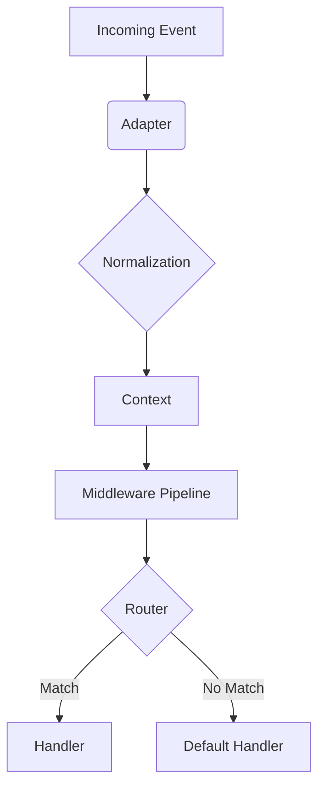

# Architecture

`wts-core` is designed with a modular and layered architecture to ensure flexibility and maintainability.

## Core Components

### 1. Client

The `Client` is the main entry point of the library. It manages the connection, handles events, and provides access to various resources. It is agnostic of the underlying adapter.

### 2. Adapters

Adapters bridge the gap between the `Client` and the WhatsApp network.

- **CloudAdapter**: Uses the official WhatsApp Cloud API (HTTP/Webhooks).
- **BaileysAdapter**: Uses the Baileys library (WebSocket) to emulate a real device.

### 3. Context

The `Context` object is passed to all event handlers and middleware. It encapsulates the incoming message/event, provides helper methods (like `reply`, `react`), and holds the current state.

### 4. Resources

Resources provide a structured way to interact with specific WhatsApp features:

- `chat`: Send messages, manage chats.
- `user`: User profile management.
- `contacts`: Contact management.
- `media`: Media upload and download.
- `flows`: WhatsApp Flows management.
- `commerce`: Catalog and order management.

### 5. Plugins

Plugins extend the functionality of the `Client`. They can add new methods, handle specific events, or integrate with external services.

### 6. Middleware

Middleware functions sit between the incoming event and your handlers. They can be used for logging, authentication, rate limiting, etc.

## Request Flow

1.  **Incoming Event**: A webhook (Cloud) or WebSocket message (Baileys) is received.
2.  **Normalization**: The adapter normalizes the raw data into a standard format.
3.  **Context Creation**: A `Context` object is created.
4.  **Middleware**: The context passes through the registered middleware pipeline.
5.  **Routing**: The router matches the context against registered filters.
6.  **Handler Execution**: The matching handler is executed.

## Diagram

